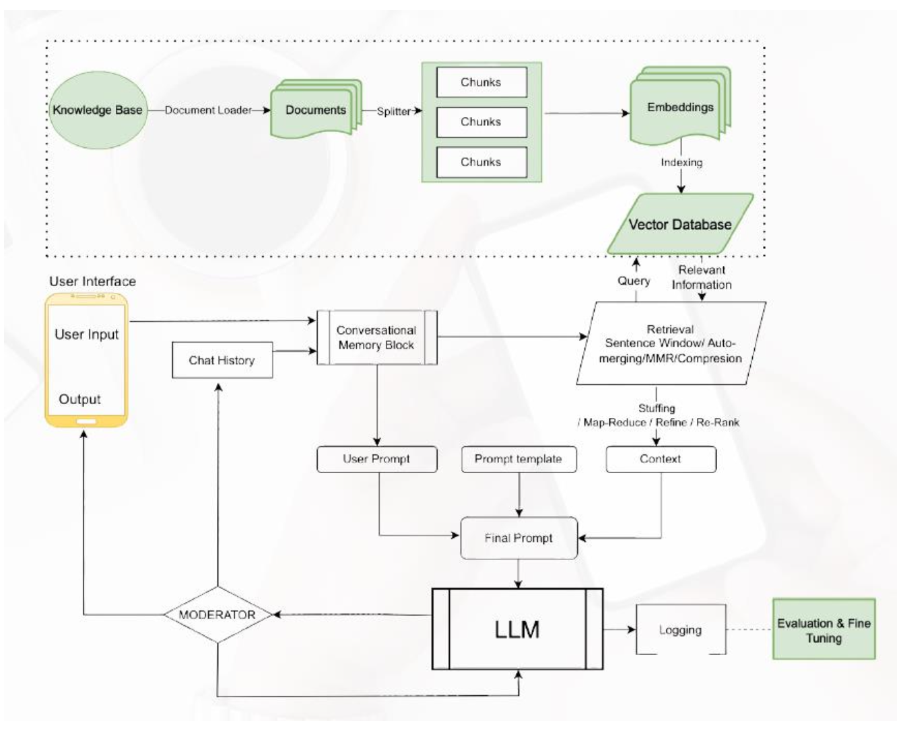
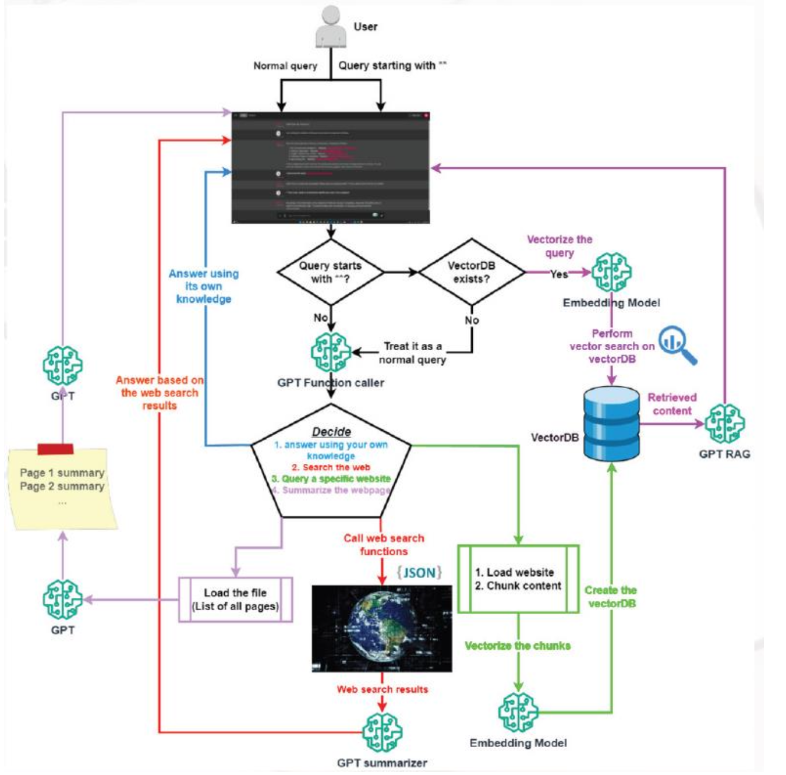

# Chat_Bot
Final_Project
VANI: ADVANCED MULTI-MODAL CHATBOT
1. Introduction
Background
Large Language Models (LLMs) have emerged as a game-changer in natural language
processing. These models, trained on vast amounts of text data, possess an uncanny ability to
understand context, generate coherent responses, and even mimic human-like conversation.
However, their potential remains largely untapped due to the complexity of integrating them
into practical applications. In an era where technology is rapidly advancing, communication
has become more diverse and dynamic. Enter Vani, a groundbreaking AI chatbot designed to
revolutionize the way individuals interact with language models. Vani seamlessly bridges the
gap between cutting-edge technology and intuitive user experiences, empowering users with
the power of Large Language Models (LLMs).
The Birth of Vani
In the ever-evolving landscape of artificial intelligence, Vani emerges as a revolutionary AI
chatbot—a bridge between cutting-edge technology and intuitive user experiences. Created
by a dynamic team of passionate engineers, linguists, and designers, Vani aims to
democratize Large Language Models (LLMs) for everyone.
Ankur Helak, Soham Sanyal, Praveen Kumar Singh, and Kishnu Srivastava shared a common
vision: to unlock the potential of LLMs and make them accessible beyond research labs and
tech giants. They envisioned a chatbot that seamlessly integrates LLMs into everyday
conversations, empowering users with natural language understanding and generation
capabilities.
Motivation Behind the Project:
The motivation behind this project stems from a deep recognition of the critical role that an
accurate and an efficient LLM powered chatbot play in the life cycle of an enterprise.
This project is driven by several key motivations:
● Democratizing LLMs: Large Language Models (LLMs) have immense potential in
natural language processing. However, their adoption remains limited due to
complexity. Vani aims to democratize LLMs by making them accessible to everyone,
from students to professionals.
● User-Friendly Interaction: Vani bridges the gap between cutting-edge technology
and intuitive user experiences. It’s designed for seamless interaction, regardless of
technical expertise. Whether you’re drafting an email or brainstorming ideas, Vani
assists effortlessly.
● Contextual Understanding: Vani doesn’t treat sentences in isolation. It comprehends
context, remembers past interactions, and adapts to individual styles. Conversations
with Vani feel natural and relevant.
● Multilingual Support: Vani isn’t confined to English. It supports 11 Indian
languages, including Hindi, Bengali, Tamil, and more. Users can communicate in
their preferred language, enhancing inclusivity.
● Privacy and Security: Vani ensures user privacy. Conversations remain encrypted,
and data flow is restricted to maintain confidentiality.
Objective:
The primary objective of this project is to develop an advanced LLM chatbot that can be
tailored according to the specific need of the customer and making it available even to small
enterprises.
Specific Objectives:
1. Develop a UNETR-Based Segmentation Model: Train and optimize a UNETR
model to accurately segment sperm cells in microscopic images, delineating the
boundaries of the head, acrosome, midpiece, tail, and background regions.
2. Enhance Segmentation Accuracy: Achieve a higher level of segmentation accuracy
compared to existing CASA systems, particularly in challenging scenarios with
diverse sperm morphologies, varying staining protocols, or limited labelled data.
3. Improve Robustness and Generalizability: Ensure that the developed model is
robust to variations in sperm samples and image quality, enabling consistent and
reliable segmentation across different datasets and experimental conditions.
4. Leverage Unlabelled Data: Explore and implement unsupervised domain adaptation
techniques to effectively leverage unlabelled sperm datasets for model training and
performance enhancement.
5. Validate and Evaluate Model Performance: Rigorously validate the model's
performance using diverse datasets and appropriate evaluation metrics (e.g.,
Intersection over Union, Dice coefficient, pixel accuracy). Compare the model's
performance to existing CASA methods and establish its superiority in terms of
accuracy, robustness, and efficiency.
6. Generate Synthetic Sperm Images: Develop and implement a methodology for
generating synthetic sperm images with realistic variations in morphology, size, and
orientation to augment the training data and improve the model's generalization
capabilities.
2. Methodology
RAG- Retrieval Augmented Generation

1. Knowledge Base:
o This block represents a repository of information. It connects to a “Content
Loader” block, which fetches data from various sources such as documents
and scripts.
o The “Documents” and “Scripts” blocks feed into the “Chunks” block, where
content is broken down into smaller units for further processing.
2. Embeddings:
o The “Chunks” from both documents and scripts flow into the “Embeddings”
block. Embeddings are vector representations of words or phrases, capturing
their semantic meaning.
o These embeddings are then used for downstream tasks.
3. Indexing:
o The “Embeddings” lead to an “Indexing” block. Indexing likely involves
organizing and optimizing the embeddings for efficient retrieval.
o This step prepares the data for quick access during chatbot interactions.
4. Vector Database:
o The “Indexing” block connects to a section labelled “Vector Database.”
Where the processed embeddings are stored or indexed in this database.
o It’s where the chatbot retrieves relevant information during conversations.
5. User Interface:
o On the left side, we have the “User Interface” section.
o It includes an input box labelled “User Input” (where users type their queries)
and an output box labelled “Output” (where the chatbot responds).
o Between these boxes, there’s a “Chat History” block and a “Conversational
Memory Block.”
6. LLM (Language Learning Model):
o The central block labelled “LLM” represents the heart of the chatbot—the
language model.
o It receives input from the user interface and the vector database.
o Within LLM, there are processes like “Map/Reduce/Filter,” “Refine Re-
Rank”.
7. Moderator:
o To the left of LLM, there’s a small rectangle labelled “MODERATOR.” Its
role is to prevent the LLM from giving responses that might be inappropriate
or offensive. It will act as a guard rail to prevent the chatbot from jail-
breaking.
8. Logging & Evaluation & Fine Tuning:
o To the right of LLM, three interconnected blocks represent logging,
evaluation, and fine-tuning.
o These blocks will contribute to improving the chatbot’s performance over
time.
In summary, this flowchart outlines the intricate processes involved in creating an AI chatbot
like Vani, from data retrieval and processing to language modelling and user interaction.
3. Chatbot Architecture

Product Architecture
1. User Queries:
o The process begins with user queries. These can be normal queries or queries
starting with specific keywords (e.g., “**”).
o These queries serve as input for further processing.
2. Vectorization of Queries:
o The user queries are vectorized, transforming them into numerical
representations.
o Vectorization allows efficient comparison and retrieval of relevant
information.
3. Answer Generation:
o Based on the vectorized queries, the system generates answers.
o If the query starts with “**”, it treats it as a vector search on the Vector DB.
o Otherwise, it uses GPT (Generative Pretrained Transformer) models to
summarize content or provide answers.
4. Web Search Results:
o If the query requires web search, the system retrieves web search results.
o It summarizes the content from web pages using GPT summarizers.
5. Embedding Model:
o The retrieved content is fed into an “Embedding Model.”
o This model likely converts the textual content into embeddings (dense vector
representations).
6. GPT RAG (Retrieval-Augmented Generation):
o The GPT RAG model combines retrieval-based and generation-based
approaches.
o It retrieves relevant information (using embeddings) and generates coherent
responses.
7. Page Summaries:
o The system summarizes web pages into page summaries.
o These summaries provide concise information for answering user queries.
8. Web Search Functions:
o The system performs web search functions, including loading websites,
chunking content, and calling web search APIs.
o It retrieves relevant information from web pages.
9. Vector DB:
o The Vector DB handles vector searches.
o If the query is treated as a vector search, it looks up relevant vectors in the
database.
10. GPT Function Caller:
o This block likely invokes specific GPT functions for summarization or content
generation.
o It plays a crucial role in answering user queries.
11. GPT Summarizer:
o The GPT Summarizer summarizes content from web pages.
o It condenses lengthy information into concise summaries.
In summary, this flowchart illustrates how user queries are processed, vectorized, and used to
retrieve relevant information from web pages. The integration of LLM models, vector
databases, and web search functions ensures efficient and accurate answers.